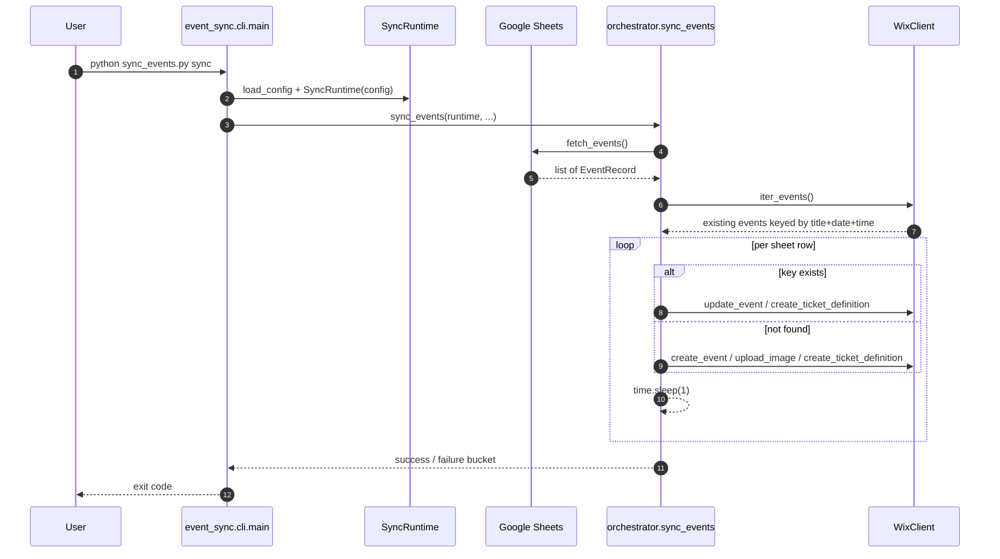
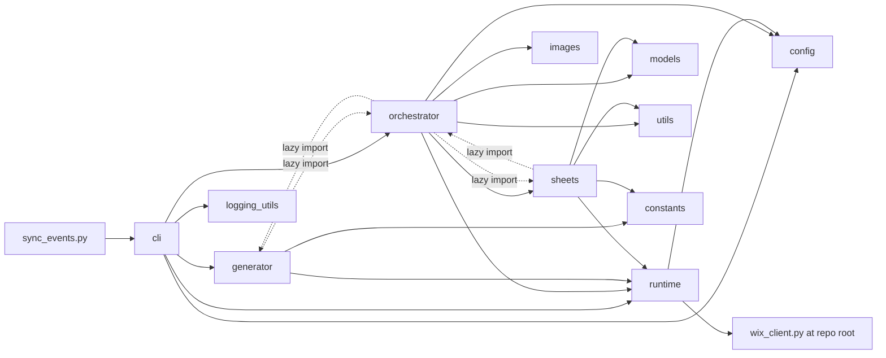

# Holistic Code Audit (2026-05-27)

A candid, code-level walkthrough of the `event_automation` repo. Every claim is anchored to a file and, where useful, line numbers. The intent is to describe what the application is, how it is wired, and where it would fail an open-source review even though it will not be open-sourced.

This document supersedes the previous self-congratulatory `CODE_AUDIT.md`.

---

## 1. Executive summary

The project is a working tactical tool that does one thing reasonably well: it shovels rows from a Google Sheet into Wix Events on a schedule. The bones are right - a CLI entrypoint, a `SyncRuntime` that lazily wires Google and Wix clients, typed `EventRecord` rows, and pytest in CI. The reality on top of those bones is less flattering:

- `event_sync/orchestrator.py` is 1,690 lines - roughly 46% of the package - and behaves like a god module covering timezone math, markdown-to-HTML conversion, credential validation, full sync, config push, category round-trips, and cleanup.
- Three different paths (`sync_events`, `push_config_events`, `push_category_config`) duplicate the event-match key, the category add/remove diff, the results-bucket print, and the `time.sleep(1)` pacing.
- Single-tenant assumptions are baked into the code: a Birdhaus Toronto address, Ontario HST, an Ontario timezone, and a hard-coded `"rope"`+`"class"` category filter in the cleanup path.
- A second module - `wix_client.py` - lives at the repo root rather than inside the `event_sync` package, which means `from wix_client import WixClient` reaches across what should be a package boundary.
- Two scripts that look like tests (`test_capacity_fix.py`, `test_ticket_automation.py`) sit at the repo root. One of them is collected by pytest and "passes" without ever asserting anything because it just `return False`s on failure. The other is not collected because it has no `test_*` function. Neither belongs where it is.
- `dev_tickets.py` is broken at import: `from typing import List` is missing, so `python dev_tickets.py` raises `NameError` before doing anything.
- Two tests in `tests/` reference an `EventRecord.categories` field and a `_resolve_wix_category_ids` symbol that do not exist on the current branch. They have drifted from production code.
- The entire `.claude/` directory is tracked in git, including two duplicate worktrees and per-session memory markdown.
- The README claims an MIT license. There is no LICENSE file.
- CI runs `pytest` and nothing else; the README claims CI does "lint + tests".

By the numbers:

- `event_sync/orchestrator.py`: 1,690 lines, 34 top-level functions.
- `event_sync/generator.py`: 961 lines.
- `wix_client.py`: 521 lines.
- `dev_events.py`: 673 lines, all `print()` no logging.
- 42 collected pytest tests; the substantive suite is `tests/test_orchestrator_category_config.py`. Whole modules (`generator.py`, all of `sync_events()`, `config.load_config`, `fetch_config_events`, image download/upload, most of `wix_client.py`) have zero unit tests.
- Recent commit messages: `dd`, `updates`, `testing`, `test`.

---

## 2. How the application works

The user-facing model is a two-step workflow with three round-trip side-paths:

- Main pipeline: `prepare-sheet` rebuilds the `generated_events` tab from the `rolling_schedule` and `class_info` tabs, then `sync` pushes that tab to Wix.
- Config round-trip: `pull-config` snapshots live Wix events into `config_events`; humans edit; `push-config` patches changes back to Wix.
- Categories round-trip: `pull-categories` writes a thin `category_config` tab; `push-categories` reads only the `categories` column and applies adds/removes on Wix.

Production entrypoints:

- [sync_events.py](../sync_events.py) - 19-line back-compat wrapper that delegates to `event_sync.cli.main`.
- [.github/workflows/sync-events.yml](../.github/workflows/sync-events.yml) - scheduled and manual; runs only `python sync_events.py sync`.
- [Makefile](../Makefile) - developer ergonomics; broad set of `dev-*` targets.

A `sync` run looks like this end to end:

The dependency graph inside `event_sync/` is mostly clean except for two lazy-import cycles that exist purely to dodge an `ImportError`:

The dashed edges are the smell. [event_sync/sheets.py:248](../event_sync/sheets.py) imports `CATEGORY_CONFIG_COLUMNS` from `orchestrator` inside a function because that constant should live in `constants.py`. [event_sync/orchestrator.py](../event_sync/orchestrator.py) returns the favor by lazy-importing `pull_config_events` and a handful of generator helpers in `main`. None of this needs to exist if the column constants live in `constants.py` and the Wix→sheet pull moves into the orchestrator.

---

## 3. Module-by-module walkthrough

### `sync_events.py` and `event_sync/__init__.py`

- [sync_events.py](../sync_events.py) is a clean 19-line wrapper. Nothing to flag.
- [event_sync/__init__.py](../event_sync/__init__.py) exports only `main`. If anyone ever wanted to use this as a library (which is plausible - the runtime, config, and orchestrator helpers are genuinely reusable), there is no programmatic surface to import.

### `event_sync/cli.py` (295 lines)

- [`build_parser`](../event_sync/cli.py) (lines 50-193) is mechanical but long; a small command-registry dict would shrink `main`.
- [`main`](../event_sync/cli.py) is a long `if args.command == ...` chain (lines 209-283) with lazy imports inside the dispatch branches (lines 228, 233, 243, 253, 263, 268, 273, 278). The mix of top-level imports for `sync`/`list`/`test`/`validate` and lazy imports for everything else is inconsistent and exists only to paper over module-startup costs.
- Two `--log-level` arguments are declared (lines 60-65 and 67-72) so that `--log-level DEBUG sync` and `sync --log-level DEBUG` both work. The trick uses `argparse.SUPPRESS` so the subparser only overrides when explicitly passed. It is clever and undocumented; a comment is there but the mechanism is non-obvious.
- The validate subcommand (lines 209-211) intentionally bypasses `_ensure_command_config` so it can report missing credentials itself - asymmetric but defensible.
- `_ensure_command_config(command, config)` (line 24) takes `config` untyped.
- The catch-all `except Exception` at line 287 swallows everything as an unhandled error. Defensive, but it also means any bug looks identical to a Wix timeout.

### `event_sync/config.py` (103 lines)

- [`load_dotenv()`](../event_sync/config.py) runs at import time (line 13). That means importing `event_sync.config` for any reason - including a test - silently reads `.env` from disk. Move it to `load_config()` or to `cli.main`.
- The dataclass declares `sheet_range`, `timezone`, and `config_events_tab` with defaults (lines 29, 30, 35) but `load_config()` (lines 85-100) __never reads env overrides for any of them__. That is a hidden trap: setting `CONFIG_EVENTS_TAB=foo` in `.env` quietly does nothing. The README documents `CATEGORY_CONFIG_TAB` (line 271) and it is wired; the others are not.
- `validation_errors()` (lines 48-62) does not consider `WIX_ACCOUNT_ID` required, but `validate_credentials()` in the orchestrator treats it as required. These two views of "what is valid" need to agree.
- `google_credentials` (lines 69-82) returns `None` on malformed JSON or missing `client_email`. That is intentional, but `_load_credentials_info` in [runtime.py:48](../event_sync/runtime.py) then does `json.loads(json.dumps(creds_json))` - a useless round-trip.

### `event_sync/constants.py` (107 lines)

- [`COLUMN_MAPPING`](../event_sync/constants.py) has `"ticket_price"` declared twice (lines 59 and 66). Python silently keeps the second; this is a real bug surface.
- [`CATEGORY_PRICING`](../event_sync/constants.py) (lines 4-38) has 30+ entries that are case variants of the same handful of names. The right shape is a normalize-once lookup, not a literal table of every capitalization a human might type.
- `DEFAULT_LOCATION` (line 41) is `1233R Queen St W, Toronto, ON M6K 1L5, Canada`. `DEFAULT_TAX_NAME = "HST"`, `DEFAULT_TAX_RATE = "13"` (lines 46-47) are Ontario-specific. None of this should be a Python constant; it belongs in the `defaults` sheet tab or in env vars.
- The `category` column accepts both `categories` and the misspelling `catagories` (line 52). The misspelling survives in the generator output schema too; do not "fix" it without checking downstream callers.

### `event_sync/logging_utils.py` (21 lines)

- [`configure_logging`](../event_sync/logging_utils.py) sets `format="%(message)s"` (line 13). The result is unsearchable logs with no timestamp, level, or module name - fine for an interactive CLI, hostile for CI failure triage and for any future structured log shipping.

### `event_sync/utils.py` (57 lines)

- [`build_column_map`](../event_sync/utils.py) does `normalized_headers.index(normalized)` inside its inner loop (line 26). For wider sheets this is unnecessary O(n*m); a `{header: index}` dict built once would be O(n+m).
- [`convert_date_to_iso`](../event_sync/utils.py) accepts both `%m/%d/%Y` and `%d/%m/%Y` (line 35), in that order. `03/04/2026` is ambiguous and the function silently picks one. For an internal Canadian tool this is probably fine; it deserves a comment.

### `event_sync/models.py` (167 lines)

- [`EventRecord`](../event_sync/models.py) is two models pretending to be one: the sync-required fields (lines 17-31) and the config-push fields tacked on (lines 33-43). Either split into `EventRecord` and `ConfigEventRecord` or model the extension as a composition.
- [`parse_tickets`](../event_sync/models.py) (line 119) takes `ticket_price` untyped. On unparseable input it appends `0.0` and moves on (line 144). A free ticket because someone typed `$30.00` is not a great default.
- `to_payload()` (line 105) is a one-liner over `model_dump()` and almost never the right thing to call; consumers should use Pydantic's API directly.

### `event_sync/runtime.py` (106 lines)

- [`from wix_client import WixClient`](../event_sync/runtime.py) (line 12) reaches outside the package. Either move `wix_client.py` under `event_sync/` or treat it as an external dependency with its own package.
- `_load_credentials_info` (line 48) does `json.loads(json.dumps(creds_json))`. Drop it.
- `get_sheets_service` and `get_drive_service` return untyped objects from `googleapiclient.discovery.build`. That is unavoidable upstream, but `Any` aliases or a thin Protocol wrapper would at least let callers be typed.

### `event_sync/images.py` (188 lines)

- Bare `except Exception` on the Drive download (line 43), the Pillow read (line 79), the EXIF transpose (line 85, swallowed completely), and the entire upload (line 183). The Drive case in particular masks API errors, network errors, and bugs identically.
- The compression grid `scales = [1.0, 0.9, ...]`, `qualities = [90, 85, ...]` (lines 93-94) is magic. Either name it in `constants.py` or comment why these specific stops were chosen.
- `from typing import cast` happens mid-function at line 170. Move it to the top.

### `event_sync/sheets.py` (296 lines)

- [`fetch_events`](../event_sync/sheets.py) (lines 29-126) and [`fetch_config_events`](../event_sync/sheets.py) (lines 129-235) share roughly 90% of their bodies. The header read, the per-row column accessor, the price/capacity coercion, and the `EventRecord` instantiation are nearly identical. The only meaningful differences are the default `registration_type` (RSVP vs TICKETING) and the extended ticket/tax/sale fields. Extract a `_parse_sheet_rows(rows, *, extended=False, default_reg_type=...)`.
- `fetch_config_events` hardcodes the range as `f"{tab_name}!A1:Z500"` (line 143) and `fetch_category_config_rows` does the same (line 261). `fetch_events` honors `runtime.config.sheet_range` (line 42) but only for the generated tab. Pick one approach.
- [Lazy import from orchestrator](../event_sync/sheets.py) (line 248) for `CATEGORY_CONFIG_COLUMNS` is the most concrete artifact of the layering bug. The constant has no business living in the orchestrator.

### `event_sync/generator.py` (961 lines)

- Three near-duplicate sheet-write functions: `write_to_sheet`, `write_config_to_sheet`, `write_category_config_to_sheet`. Each builds headers, ensures a tab exists, clears it, writes rows, then applies formatting. Extract one helper.
- [`pull_config_events`](../event_sync/generator.py) reads live Wix events and renders them into a sheet. That belongs in the orchestrator (or a new `wix_export.py`), not in a module whose job is "merge schedule + class info into the generated tab".
- `_normalize_category_slug` exists but is unused; the merge code at lines 411-414 inlines slug logic.
- The CSV-to-stdout path mutates the root logger to redirect handlers to `stderr` (around line 928-932) so the CSV stream stays clean. That works but it is a global side effect. A `print(..., file=sys.stdout)` for the CSV and a `--csv-output PATH` option is the right shape.
- Sheet write helpers wrap entire blocks in `except Exception` (lines 531, 556, 681, 736, 789, 856) and continue. Failures get logged and the function returns. That hides "I cleared the tab but failed to write rows" from callers.

### `event_sync/orchestrator.py` (1,690 lines) - deep dive

This is the file that drags the whole codebase down. It contains 34 top-level functions covering timezone conversion, markdown-to-HTML, credential validation, six different end-to-end commands, and a handful of shared helpers. The three biggest commands - [`sync_events`](../event_sync/orchestrator.py) (line 828), [`push_config_events`](../event_sync/orchestrator.py) (line 1081), and [`push_category_config`](../event_sync/orchestrator.py) (line 1496) - share a recognizable shape: fetch sheet rows, fetch Wix events, build a key map, iterate, diff, apply, sleep, log buckets. They share the shape but not the code.

Specific concerns:

- The event match key `f"{title}|{YYYY-MM-DD}|{HH:MM}"` is built in at least six places: lines 850, 962, and similar spots in `push_config_events` and `push_category_config`. There is no shared helper.
- Module-level mutable cache: `_category_cache: Dict[str, str] = {}` and `_category_cache_loaded = False` at lines 624-625, mutated by `_resolve_category_id`. This is fine for a one-shot CLI invocation; it is a footgun in tests, REPL sessions, or any future long-lived process.
- Roughly 25 `except Exception:` blocks. Notable spots: lines 48, 56, 82, 321, 340, 403, 442, 654, 677, 712, 768, 823, 942, 1026, 1075, 1248, 1266, 1281, 1291, 1322, 1449, 1559, 1623, 1640, 1686. Most log and continue. The category-resolution and category-assignment ones (lines 654, 677) are particularly broad: a 401 from Wix and a typo in the category name look identical to the caller.
- Hard-coded `time.sleep(1)` rate limiting in five places (lines 883, 901, 1298, plus `0.3` at 1018 and a similar pause in the category push around 1650). There is no central rate-limit helper, and no signal that 1 second is the right number.
- `clean_synced_events` filters on `"rope" not in cat_names or "class" not in cat_names` (lines 985-986). That is the venue's class taxonomy hard-coded into a "clean up synced events" path. Make it config-driven or take a `--category` flag.
- `format_description_as_html` (lines 209-270) implements its own markdown subset with `_inline_markdown` (line 189) doing raw `href` injection without URL validation. If the source sheet were ever untrusted, that is a stored XSS path through the Wix description field. Move it to a `text_format.py` module and validate URLs.
- Parallel `zoneinfo` / `pytz` / naive-UTC fallback branches in `_wix_timestamp` (lines 35-62) and `_localize_wix_start` (lines 65-111). Same logic, two implementations.
- `_diff_event_fields` (line 528) is the place where field-level diffing should live, but the duplicated category add/remove logic in `push_config_events` and `push_category_config` operates on its own. Wrap it in a `diff_categories(wix_event, sheet_names) -> (add, remove)` helper used in both.
- In `push_config_events`, the ticket diff matches existing tickets by `name` only (around lines 1155-1184). New ticket types added on Wix that do not appear in the sheet are silently kept; renamed sheet tickets create new definitions instead of updating.
- In `sync_events`, if an existing event is unchanged the orchestrator still calls `_repair_missing_tickets` on every run (lines 885-887). On a sheet of 60 events that means 60 extra `get_ticket_definitions` calls per sync to "repair" things that are not broken.
- `CATEGORY_CONFIG_COLUMNS` and `_CATEGORY_READONLY_COLUMNS` (lines 608-621) are pure column-schema constants. They belong in `constants.py`.

### `wix_client.py` (521 lines)

- [`load_dotenv()`](../wix_client.py) at import time (line 17) again. Importing the client mutates global env state.
- [`WixClient.__init__`](../wix_client.py) uses `api_key: str = None` instead of `Optional[str]` (line 29). Minor, but it telegraphs that the rest of the file is more loosely typed than the package code.
- The retry logic in [`_request`](../wix_client.py) (lines 77-128) retries on 429 with `2**attempt` backoff (lines 97-102), retries on `Timeout` immediately with no sleep (lines 113-117), retries on `ConnectionError` with backoff (lines 119-125), and does __not__ retry on 5xx server errors. A Wix 502 is treated as terminal. There is also no `Retry-After` header parsing.
- `WixApiError` is declared at line 22 and `raise`d once at line 128 in an unreachable branch. Real callers see `requests.HTTPError`. The custom exception is effectively dead.
- The presigned-URL `upload_image` step at line 352 uses `requests.put` directly instead of going through `_request`, so it has no retry coverage.
- Error logging dumps the full Wix response body (lines 106-109). That is useful for debugging and risky in shared logs; flag whether the body might include user data.
- Pagination is solid where it exists: [`_paged_post`](../wix_client.py) (lines 132-188) handles both cursor and offset, and is exercised by `tests/test_wix_client.py`. But [`query_categories`](../wix_client.py) hardcodes `limit: 100` and never paginates (lines 470-477), [`get_ticket_definitions`](../wix_client.py) does the same (lines 450-463), and [`search_events_by_title`](../wix_client.py) iterates the entire event stream client-side to filter (lines 510-516).
- [`has_orders`](../wix_client.py) at line 262 swallows everything to `True`. That is a fail-safe choice for delete (do not delete an event we cannot prove is empty), but it makes "Wix is down" indistinguishable from "this event has orders". Worth documenting.

---

## 4. Dev tools and stray scripts

### [`dev_events.py`](../dev_events.py) (673 lines)

- All `print()`, no logging. Inconsistent with the package, fine in isolation.
- `create_test_event` accepts `draft: bool = True` (line 110) and on line 175-179 prints a warning if Wix returns a non-DRAFT event. But the actual call at line 166 is `client.create_event(event_data)` - the `draft=draft` kwarg is __never passed__, and `WixClient.create_event` supports it (line 241). So `draft=True` does nothing and the warning fires every time.
- `bulk_delete_events` (lines 251-314) and `delete_events_after_date` (lines 327-409) share nearly identical delete loops with `time.sleep(0.3)` pacing.

### [`dev_tickets.py`](../dev_tickets.py) (196 lines)

- __Broken at runtime__: line 56 references `List[Dict]` but `from typing import List` is missing. `python dev_tickets.py` raises `NameError: name 'List' is not defined` before parsing args. `make dev-add-ticket` does not work.
- `add_ticket_to_event` expects `result.get('ticketDefinition', {})` (line 41), but `WixClient.create_ticket_definition` returns the ticket dict directly (`wix_client.py` line 367+). Whatever ticket IDs and names this script prints are always empty.
- `create_test_ticket_order` (line 56) is defined but never wired to the CLI dispatch (lines 115+). Dead code.
- Module docstring still references RSVP automation (lines 3-4) which was removed.

### [`inspect_tickets.py`](../inspect_tickets.py) (77 lines)

- Calls `client._request(...)` directly (line 40-44). Reaching into a private method from a sibling script is a code smell, especially when there is a public `get_ticket_definitions`.
- Looks for ticket fields `limited` and `quantity` that are obsolete; production code uses `initialLimit`/`actualLimit`.

### [`test_capacity_fix.py`](../test_capacity_fix.py) (141 lines)

- Not a pytest test - no `test_*` function. pytest does not collect it. It is a one-off manual script that hits the live Wix API. It still imports `from dev_events import create_test_event` (line 7) without using it.
- Asserts on the same obsolete `limited`/`quantity` field names (lines 108-112). It is verifying a fix in a way that would never catch a regression because the field name it checks against is wrong.

### [`test_ticket_automation.py`](../test_ticket_automation.py) (137 lines)

- Named `test_*.py` at the repo root, so pytest __does__ collect it: `test_ticket_automation.py::test_ticket_automation`.
- It hits the live Wix API, creates a real event, and returns `True`/`False`. There are no `assert` statements. pytest considers a function that returns a value to be passing as long as it does not raise. So this test passes whether the Wix API call succeeded or not, and it does not raise on failure - it just `return False`s on line 28, 65, and 91.
- If CI ever had credentials in scope, this would create live test events on every run and "pass" silently. Today it raises before that because `WixClient()` fails without credentials, which pytest reports as an error.

Either move both to `scripts/` and rename them so pytest stops collecting, or convert them into real `responses`-mocked tests in `tests/`.

---

## 5. Tests

### What is covered

- [`tests/test_models.py`](../tests/test_models.py): `EventRecord` validation and normalization (4 tests).
- [`tests/test_description_formatting.py`](../tests/test_description_formatting.py): `format_description_as_html` and `_wix_timestamp` (11 tests). Strong coverage for these two functions.
- [`tests/test_cli.py`](../tests/test_cli.py): config-error exits and bad `--scope` values (5 tests).
- [`tests/test_wix_client.py`](../tests/test_wix_client.py): `iter_events` cursor and offset pagination, `list_events` limit (3 tests).
- [`tests/test_images.py`](../tests/test_images.py): `prepare_image_for_wix` compression (2 tests).
- [`tests/test_orchestrator_category_config.py`](../tests/test_orchestrator_category_config.py): the category round-trip - pull, push, dry-run, scope (12 tests). This is the substantive end-to-end suite.

### What is stale

- [`tests/test_orchestrator_categories.py`](../tests/test_orchestrator_categories.py) patches `event_sync.orchestrator._resolve_wix_category_ids` (lines 41, 63). That symbol does not exist on this branch. The current `needs_update` (line 602 of orchestrator.py) only delegates to `_diff_event_fields` on event fields - it does not look up category IDs at all. The tests still pass because `monkeypatch.setattr` raises `AttributeError` only with `raising=True`, but the assertion behavior is testing logic that is no longer there.
- [`tests/test_sheets_categories.py`](../tests/test_sheets_categories.py) lines 67 and 83-84 expect `events[0].categories` as a list and `categories` to be a required column. The current `EventRecord` has `category: Optional[str]` (models.py line 19), not `categories: list[str]`, and `REQUIRED_FIELDS` (constants.py line 76) is `["event_name", "start_date", "start_time", "location"]` - no categories. These tests fail or pass for the wrong reason.

Both look like they were written for a planned refactor that never landed. Either revive the refactor or delete the tests.

### What has no tests

- All of `event_sync/generator.py` (961 lines).
- The end-to-end paths of `sync_events()`, `create_wix_event`, `update_wix_event`, `_ensure_ticket_definition`, `push_config_events`, `publish_all_drafts`, `clean_synced_events`.
- `event_sync/config.py` - no test that `load_config` does the right thing, no test of the credential JSON parse.
- `event_sync/sheets.py` `fetch_config_events`.
- `event_sync/images.py` `download_from_google_drive` and `upload_image_to_wix`.
- 20+ methods on `WixClient` (`create_event`, `update_event`, `_request` retry behavior, `upload_image`, the ticket and category CRUD methods, the orders endpoints).
- All of `cli.py` happy paths (`prepare-sheet`, `generate`, `push-config`, etc.).
- `event_sync/utils.py`, `event_sync/constants.py`, `event_sync/logging_utils.py`.

There is also no `conftest.py`, no `pyproject.toml`, no `pytest.ini`, no `[tool.pytest]` section anywhere, no coverage config, and no integration-test marker.

---

## 6. CI, build, packaging

- [`.github/workflows/ci.yml`](../.github/workflows/ci.yml) installs `requirements-dev.txt` and runs `pytest --maxfail=1 --disable-warnings -q` on Python 3.11, Ubuntu. That is all CI does. No lint, no type check, no coverage report, no minimum coverage threshold, no Python version matrix. The README at line 250 calls this pipeline "lint + tests"; it is not.
- [`.github/workflows/sync-events.yml`](../.github/workflows/sync-events.yml) runs `python sync_events.py sync` on a schedule. It never runs `prepare-sheet` first and never runs `validate` as a gate. If something corrupts the `generated_events` tab on a Tuesday, the Wednesday cron pushes it.
- There is no `pyproject.toml` and no `setup.py`. The project is not pip-installable. `event_sync/` is a package; `wix_client.py` is a top-level module; both must be on `sys.path` at the same time, which is fine for `python sync_events.py` and awkward for anything else.
- `package-lock.json` is tracked. It has the shape `{"name": "event_automation", "lockfileVersion": 3, "requires": true, "packages": {}}` and there is no `package.json`. Likely accidental.
- [`setup.sh`](../setup.sh) line 6 and 99: `echo "=".repeat 50`. That is JavaScript syntax; bash prints it literally. The repo's two "draw a 50-character line" calls are decorative but broken.
- Both [`setup.sh`](../setup.sh) and [`setup.bat`](../setup.bat) install only `requirements.txt`, not `requirements-dev.txt`. A new contributor cannot run the tests after `make setup`.
- [`requirements.txt`](../requirements.txt) mixes a `requests>=2.32.0,<3` range with exact pins on `google-auth==2.23.4` and `google-api-python-client==2.108.0` from 2023. There is no `pip-audit`, no Dependabot, no SBOM, no security-scanning step in CI.
- [`requirements-dev.txt`](../requirements-dev.txt) is `-r requirements.txt` plus `pytest==8.3.2`. No `pytest-cov`, no `ruff`, no `mypy`, no `black`.
- Recent commits: `dd`, `updates`, `testing`, `test`, `updated flow`. The git history is unreadable.

---

## 7. Documentation coherence

- [`docs/CODE_AUDIT.md`](CODE_AUDIT.md) (the document this replaces) was dated 2025-11-01 and listed "Generate an `.env.example` from AppConfig" as a future opportunity even though `.env.example` already exists. It also undersold the test suite by omitting `test_orchestrator_category_config.py`. It was an optimistic snapshot, not an audit.
- [`README.md`](../README.md) at lines 306-307 references `make dev-rsvp` and `make dev-bulk-rsvp` targets. They do not exist in the Makefile.
- [`README.md`](../README.md) lines 240-256 list a project tree that omits `generator.py` entirely - a 961-line core module - and mislocates `DEV_TOOLS.md` (it lives in `docs/`, not the root).
- [`README.md`](../README.md) lines 317-319 describe the ticket workflow as "API creates event with TICKETING registration type → Shows 'Tickets are not on sale'… You add tickets manually via Wix Dashboard". That contradicts the orchestrator, which has auto-created tickets on sync for some time (see `_ensure_ticket_definition` at line 684 of orchestrator.py).
- [`docs/README.md`](README.md) claims "Production Ready", "Zero known bugs or regressions", "Documentation complete and current". This document is itself evidence to the contrary.
- The setup flow is duplicated across [README.md](../README.md), [SETUP.md](../SETUP.md), [CHECKLIST.md](../CHECKLIST.md), and [CLAUDE.md](../CLAUDE.md). They mostly agree on commands and disagree subtly on required Google APIs (Sheets only vs Sheets + Drive) and on env vars.
- [`docs/HISTORY.md`](HISTORY.md) references merged or deleted internal docs (`TICKET_AUTOMATION_COMPLETE.md`, `TICKET_CONTROL_GUIDE.md`).

---

## 8. Repo hygiene

- The entire `.claude/` tree is tracked. That includes two duplicate worktrees under `.claude/worktrees/infallible-allen/` and `.claude/worktrees/modest-engelbart/` (full copies of README, Makefile, tests, the events CSV, etc.) plus per-session memory markdown under `.claude/projects/`. There is no `.claude/` entry in [.gitignore](../.gitignore). This is the single biggest housekeeping cleanup.
- No `LICENSE` file. [README.md](../README.md) line 358-360 claims MIT.
- No `CONTRIBUTING.md`, no `CHANGELOG.md` (the `docs/HISTORY.md` is roughly a changelog but not at the canonical path).
- No `.pre-commit-config.yaml`, no `ruff.toml`/`pyproject.toml`, no `mypy.ini`, no `.editorconfig`.
- Stray root-level integration scripts (`test_capacity_fix.py`, `test_ticket_automation.py`, `inspect_tickets.py`) that look like tests or pollute the test runner.
- Local artifacts on disk (`events.csv`, `events_output.csv`, `debug-5cc5c1.log`) are correctly gitignored via `*.csv` and `*.log` ([.gitignore](../.gitignore) lines 16 and 48). `.env` is gitignored. That part is fine.
- `.gitignore` has both `.env` (line 19) and `*.env` (line 46). The second is overbroad and would silently ignore a file named `production.env` or `staging.env` if anyone ever made one.

---

## 9. Cross-cutting architectural concerns

- __Single tenant baked in.__ The Birdhaus location, the Ontario HST defaults, the `America/Toronto` constants in dev tools, and the `"rope"`+`"class"` cleanup filter are all in code rather than in `defaults` sheet rows or env vars. Anyone forking this for a second venue rewrites Python.
- __Layering violations.__ Sheet column constants live in the orchestrator. Wix→sheet conversion lives in the generator. The orchestrator owns markdown-to-HTML. Each of these is a thirty-line fix and would let `event_sync/sheets.py:248` lose its lazy import.
- __Mixed concerns in `orchestrator.py`.__ It is the catch-all bucket. The pure functions (`_wix_timestamp`, `_localize_wix_start`, `format_description_as_html`, `_diff_event_fields`) want to be in their own modules where they could be unit-tested in isolation; the side-effecting "do a sync" functions are different beasts.
- __Global mutable state.__ `_category_cache` persists between calls within a process. Today the process is short-lived; tomorrow if anyone embeds `sync_events` in a server, this surfaces as a "stale category mapping" bug.
- __"Repair on skip".__ Every sync touches every existing event's ticket definitions even when the sheet row is unchanged. This is wasted API surface and adds 60+ extra requests per run for a 60-event sheet.
- __Two different ticket creation paths__ (`_ensure_ticket_definition` at line 684, `_create_tickets_from_config` at line 1031) implement the same idea with different defaults. Pick one or write a single helper that takes a list of `TicketSpec` and a fallback for the simple case.
- __No retry policy abstraction.__ `time.sleep(0.3)` and `time.sleep(1)` are sprinkled at call sites. The `WixClient._request` retry covers 429 only. A central `with_rate_limit(client, fn)` helper plus retry on 5xx would consolidate this.

---

## 10. What would not pass OSS muster

In rough order of how loud the reviewer would be:

1. `event_sync/orchestrator.py` at 1,690 lines is unreviewable as a single PR. Any nontrivial change forces a 100+ line diff in a god module.
2. Missing `LICENSE`. The README asserts a license the file does not grant.
3. Tests in `tests/` reference fields and functions that do not exist on the current branch. CI is green either by coincidence or because the tests do not exercise what their names imply.
4. `.claude/` worktrees and session memory tracked in version control.
5. `dev_tickets.py` crashes on import. `test_ticket_automation.py` is collected by pytest and "passes" without asserting.
6. Single-tenant constants in `event_sync/constants.py` (and `America/Toronto` in `dev_events.py:136`) treat the codebase as if it will only ever run for one venue.
7. Commit log of one- and two-character commit messages.
8. CI runs pytest only and is described in README as "lint + tests".
9. No `pyproject.toml`. Not pip-installable. `wix_client.py` outside the package it serves.
10. No type checker, no linter, no formatter, no pre-commit, no coverage. Twenty-five `except Exception` blocks in one file with no static analysis to flag them.

---

## 11. Recommendations

### Quick wins (a day or less)

- Add `.claude/` to `.gitignore`. Run `git rm -r --cached .claude/`.
- Delete `package-lock.json`. There is no Node code.
- Fix `dev_tickets.py`: add `from typing import List, Dict, Any, Optional` at the top.
- Move `test_capacity_fix.py` and `test_ticket_automation.py` to `scripts/` and rename so pytest stops collecting them. Or convert them to mocked tests in `tests/`.
- Fix [setup.sh](../setup.sh) lines 6 and 99: replace `echo "=".repeat 50` with `printf '=%.0s' {1..50}; echo`.
- Fix the duplicate `"ticket_price"` key in [event_sync/constants.py](../event_sync/constants.py) (lines 59 and 66). Decide whether `price`/`cost` should map to `ticket_price` or to a separate field.
- Wire `CONFIG_EVENTS_TAB`, `TIMEZONE`, and `SHEET_RANGE` into `load_config()` so the dataclass defaults match the docs.
- Add a `LICENSE` file (MIT, since the README claims that) or change the README claim.
- Delete `test_orchestrator_categories.py` and `test_sheets_categories.py` until the planned refactor lands; right now they encode aspirations as assertions.
- Enforce conventional or at least descriptive commit messages on `main`. `dd` and `testing` should not survive review.
- Move `load_dotenv()` out of `event_sync/config.py:13` and `wix_client.py:17` into the CLI entrypoint.

### Medium (a few days)

- Extract from `event_sync/orchestrator.py`:
  - `make_event_key(title, date_iso, time_24h)` - replaces six sites.
  - `diff_categories(wix_event, sheet_names) -> (to_add, to_remove)` - replaces the duplicated diff in `push_config_events` and `push_category_config`.
  - `apply_category_changes(client, event_id, to_add, to_remove, *, dry_run)` - centralizes the assign/unassign loop and the rate-limit sleep.
  - `log_results_bucket(results)` - replaces the four near-identical "now print the success / failure / skipped lists" blocks.
- Split `push_config_events` into `_diff_config_row(...)` and `_apply_config_changes(...)`. Keep the CLI-level entrypoint thin.
- Extract `format_description_as_html` and the markdown helpers into `event_sync/text_format.py`. Validate URLs in `_inline_markdown`.
- Move `CATEGORY_CONFIG_COLUMNS` and `_CATEGORY_READONLY_COLUMNS` into `constants.py`. This kills the lazy import in `sheets.py:248`.
- Move `pull_config_events` and `_wix_event_to_config_row` out of `generator.py` and into orchestrator (or a new `wix_export.py`).
- Extract a shared `_parse_sheet_rows(...)` used by both `fetch_events` and `fetch_config_events`.
- Extract a shared `_ensure_tab_and_write_rows(...)` used by the three sheet-write functions in `generator.py`.
- Replace the two parallel `zoneinfo`/`pytz` branches in `_wix_timestamp` and `_localize_wix_start` with a single helper.
- Add a `pyproject.toml` that defines the package, configures pytest (`testpaths = ["tests"]`), and configures ruff + mypy. Expand CI to run ruff and mypy. Add `pytest-cov` and report coverage on PRs.
- Cache `get_ticket_definitions` per-event in a `SyncRuntime` field so the "repair on skip" path does not re-query for every unchanged event.

### Larger refactors

- Parameterize tenant data: `DEFAULT_LOCATION`, the tax constants, the `CATEGORY_PRICING` table, and the `"rope"`+`"class"` cleanup filter should come from the `defaults` sheet tab or from env vars. The codebase should be re-runnable for a second venue without a code change.
- Package `wix_client.py` under `event_sync/` (or extract into its own installable package). Either way, eliminate the cross-package import at `runtime.py:12`.
- Add real integration tests for the sync path using `responses` (HTTP stubs for `requests`). Mock a Wix that has two existing events and a sheet that wants three, and assert on the `create`/`update`/`skip` decisions. Then do the same for `push_config_events`.
- Replace the hand-rolled retry in `WixClient._request` with `requests.adapters.HTTPAdapter` + `urllib3.util.retry`, configured to back off on 429 and 5xx. Parse `Retry-After`. Wrap `upload_image`'s presigned PUT in the same retry path.
- Tighten `EventRecord`: split into `EventRecord` (sync-required) and `ConfigEventRecord` (push-config extension). Log on unparseable ticket prices instead of defaulting to `0.0`.
- Centralize a `RateLimiter` object on `SyncRuntime` so all "sleep between API calls" decisions live in one place and can be tuned by config.

---

This document is meant to be read once and acted on. The codebase works; the next person to maintain it should not have to discover any of the above on their own.
